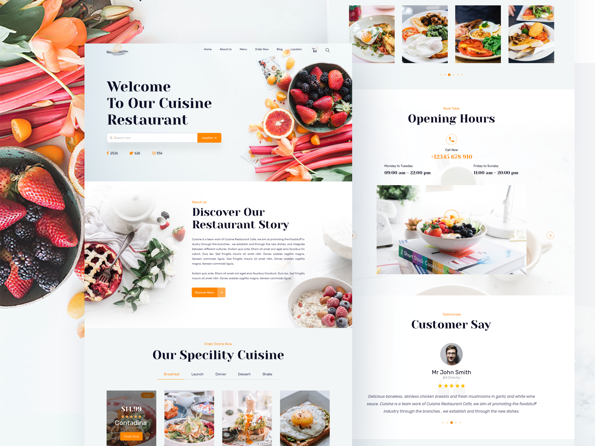

# 🛠️ Cuisine Restuarant Layout

<div align="center" >
<!-- link to project -->
    <a href='-URL TO DEMO GOES HERE-'>
    <!-- link to local image -->
        
    </a>

<br>
<br>

**Link to project:** http://recruiters-love-seeing-live-demos.com/
<br>
<br>

  <p>
      <a href="https://github.com/rayanthoney/100Devs-Bootcamp/tree/master/100Devs-layouts/ram_cuisine-restaurant-layout" target="_blank">
      
      </a>
      <a href="-URL DEMO GOES HERE-" target="_blank">
      
      </a>
  </p>
</div>

<div>
  <p>
  Write a short sentence or two about this project and what it does. Be sure to include a link and a screenshot (we're front end devs so we can actually see our work!)..
  </p>

## How It's Made :

**Technologies Used** : HTML, CSS, JavaScript, NodeJS and Vite.

  <p>
  Here's where you can go to town on how you actually built this thing. Write as much as you can here, it's totally fine if it's not too much just make sure you write _something_. If you don't have too much experience on your resume working on the front end that's totally fine. This is where you can really show off your passion and make up for that ten fold.
  </p>

<br>
<br>

  <p align="center">
    <a href="https://skillicons.dev">
      
    </a>
  </p>
</div>

<br>
<br>

## Install

```terminal
 > npm create vite@latest ./
```

```terminal
 >
 >
```

## Installing Your Packages

```terminal
  > npm install
```

## Optimizations

_(optional)_

You don't have to include this section but interviewers _love_ that you can not only deliver a final product that looks great but also functions efficiently. Did you write something then refactor it later and the result was 5x faster than the original implementation? Did you cache your assets? Things that you write in this section are **GREAT** to bring up in interviews and you can use this section as reference when studying for technical interviews!

## Lessons Learned:

No matter what your experience level, being an engineer means continuously learning. Every time you build something you always have those _whoa this is awesome_ or _fuck yeah I did it!_ moments. This is where you should share those moments! Recruiters and interviewers love to see that you're self-aware and passionate about growing.

## Examples:

Take a look at these couple examples that I have in my own portfolio:

**Palettable:** https://github.com/alecortega/palettable

**Twitter Battle:** https://github.com/alecortega/twitter-battle

**Patch Panel:** https://github.com/alecortega/patch-panel

**Patch Panel:** https://github.com/alecortega/patch-panel
